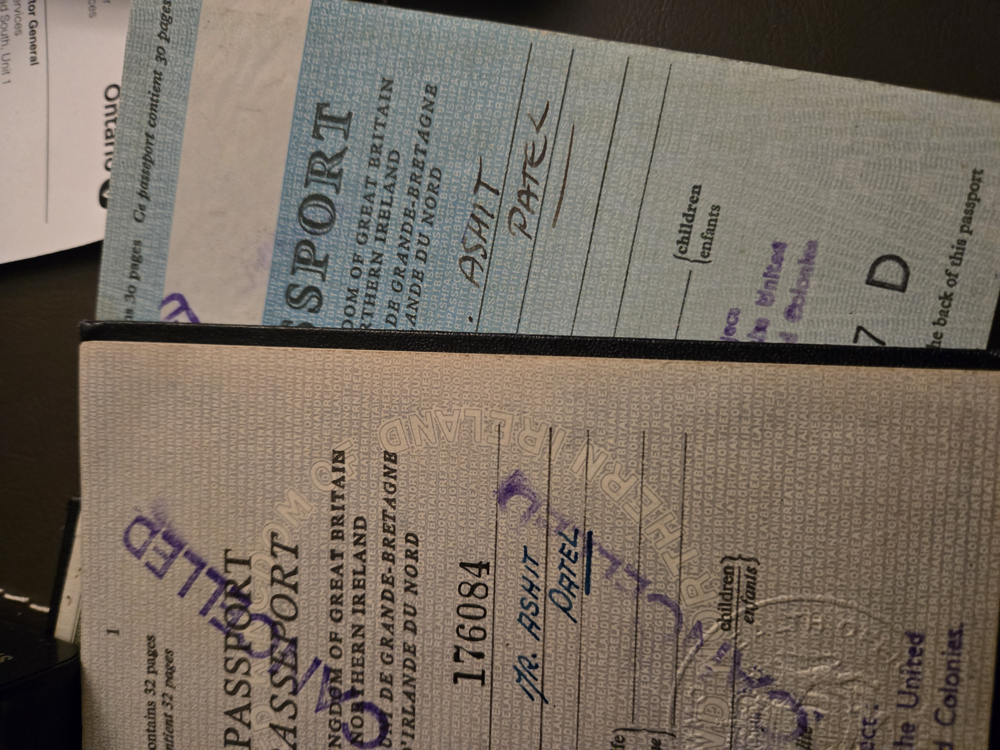

---

layout: "base.njk"
title: "The Making of Ashit Patel"
date: "2025-09-14"
tags: ["Daily Planet"]

---

Above: My first passports. The clerks at the offices in London made sure to underscore the message - I was A Tel - reminding me that I was born a free man - Mister Patel, the Indian in a brave's New World to become hopefully *mishpat* (מִשְׁפָּט) and *tel* (תֵּל) and amount to something legitimate from London's New Ham - amidst a 2000 year-old mishmash (מִישמַאש) in turn both profane and profound since the Roman first lay a ton of stone. Yet though I might still forget myself in the coming chaos and turmoil of a Fourth Turning.

## A Mound To Something ##

>What befalls each man has been ordained in some way as conducive to his destiny. For we say that things *fall* to us as the masons too say that the huge squared stones in walls and pyramids *fall* into their places, adjusting themselves harmoniously to one another in a sort of structural unity
>
>~ Marcus Aurelius, Book V, 7

A Tel is a hint passed through time by the virtuous. It comes from the Arabic تلّ  and the Hebrew תֵּל, both meaning "mound." It is an artificial hill formed by layers of human effort over centuries. These mounds accumulate as older structures are built over and compressed — a literal stratification of history. A Tel is a physical record of human activity, where past and present converge in a single layered form, encoded even within the names we are assigned.

In my ancestral Gujarati, the word તેવ (transcribed '*tev*' but pronounced as a Cockney would say 'tell') means *habit*. So my name means to place habits one after the other.

We inhabit our bodies and in habit manifest personality through action. What are we ourselves except a mound of habits to be carefully tended and curated by our constant gardener selves. Through the close inspection of introversion we tighten the interlock to build stable yet supple structures to the extent we mind and care for the matter which constitute us.

**BACK HERE**

 In 2010 beginning to discern my coming round to calling as 'Milne', I started Transition Insight and continued to construct my 'Square' as a ''full-time equivalent' and 'contractor'. At [55](https://transition-insight.com/research-%26-writing/f/a-sort-of-homecoming?blogcategory=Daily+Planet+(Toronto+Star)), still (sometimes) handsome, healthy and young with my habits intact I [became Ashit Milne](https://transition-insight.com/research-%26-writing/f/the-making-of-ashit-milne?blogcategory=Daily+Planet+(Toronto+Star)) (planet come together).  I walked away, condensing what I owned to the least amount necessary — so I might instead express a vision however imperfectly.

The clerks in the London office, where my first passports were issued, underscored a hint as to my responsibility — a quiet reminder of heritage. It's one reason I make much of tradition, particularly English heritage and the radiant qualities of the union flag.

All too often we assign blame for the growing poverty of our institutions rather than take responsibility for resolving their challenges. This is why I am an anarchist. I may not always succeed, but I will take responsibility for what I believe I can change, wherever I can.

The creation of this property asserts that I will not be owned ever again — and certainly not by those who conflate their interests with those of the general public. Words like 'conviction' can turn into a sentence; I prefer to live free or die.

The best teachers find their proteges — those who are a 'pleasure to teach' — and guide them towards their Calling. These students in turn seek out the tels in the world that whisper to them; these are the words of the prophets written on subway walls and tenement halls. If we heed these tels, we become leaders in our field.

Leadership reveals itself first as guidance: mentorship, a firm but yielding (solid yet *pukka*) hand that is always good. Leadership, at its core, begins with love. True leaders know how to inspire others to find their own path, which naturally earns them a place as 'first in class.' When all is said and done, your habits (*tel*) make you. And those habits — whether good or bad — have lindy.

There wasn't a better high school on Earth in 1983 than Richmond Hill High School (for a long time considered the best public high school in Ontario). RHHS. Our motto: *Sapere Aude* (Dare to Be Wise). We were the (Viking) Raiders — a tribute to a time when our country became pluralistic through the need to collaborate on newfound land five hundred years before Colon took his more southerly route into the continents of the Western Hemisphere.

We know right from wrong and black from white; we won't be schooled or fooled by the unprincipled. We'll own you — mark my words. We know how to wage war without even inciting violence.
