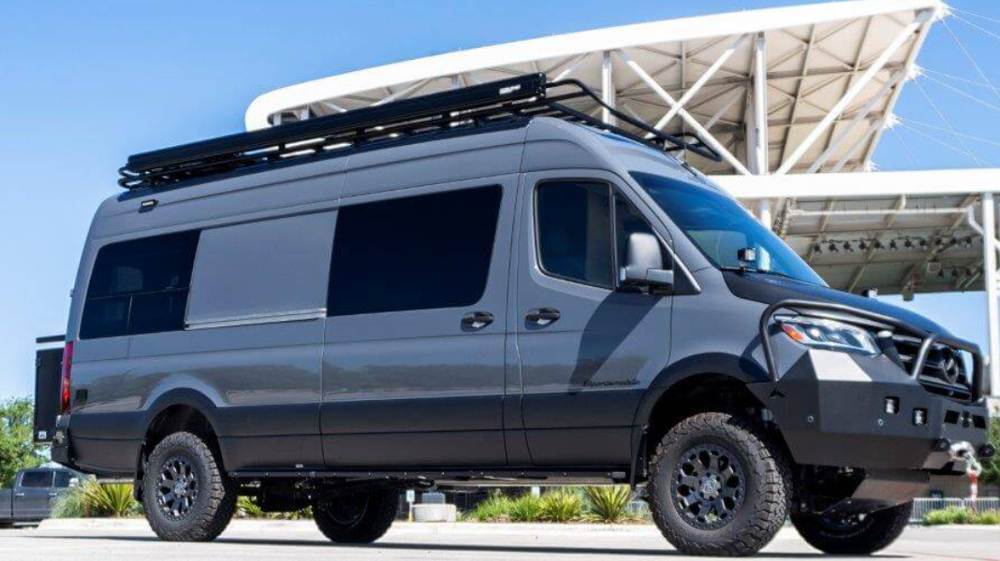

## Mercy Mercy Me

>Papers in the roadside tell of suffering and greed
>Fear today, forgot tomorrow
>Ooh-ooh, here besides the news of holy war and holy need
>Ours is just a little sorrowed talk
>
>Just blowing away
>
>And I don't cry for yesterday, there's an ordinary world
>Somehow I have to find
>And as I try to make my way to the ordinary world
>I will learn to survive
>
>~ Duran Duran (Ordinary World)

A little bit of Jagadish  जगदीश  (The Lord of Universe) here and a little bit of Jagger dash (moves like Mick) there is what *I'm* talking about - project [Juggernaut](https://en.wikipedia.org/wiki/Juggernaut) is officially on the roadmap with Sportsmobile's well-appointed Mercedes Sprinter the prime candidate. They have serious Lindy in the space, outfitting those who in our time have been tuned-in well enough to turn-up long enough to buy themselves some autonomy - and then to live on their own terms - since 1961. I'm approaching my Act III, the third stage of my life - the home stretch.

Different people at different times of their life have their own approach to living a good life. We range outwards and explore and claim the world as youth in Act I, settle into stable domesticity and fall in line dutifully to sustain and create with our patriarchy in  Act II; then we consolidate to the kernel of our truth in Act III; we stand at arm's length and objectively speak the truth about what is and how it may become more beautiful. We are no less ambitious, but we have more *flow* about us; as well an utter lack of fear.   What have we to lose after all? Nobody leaves this place alive is what you *know* and you're determined to leave something behind besides a list of credentials earned but never truly applied in the way one would want.

Now, who know what unfolds over the next two years but it's nice to dream of things that *are* actually feasible - and this most certainly is. Since sending my first email in 1993 I have spent my adult life on the internet watching it become the extraordinary utility we cannot live without. But it could be so much more and it really needs us all to use our creativity and imagination and apply it to some labour of love; culture worth having. I envision getting to grips with humanity across the planet; engrossing myself in places and people in disparate places learning about this orb and synthesizing what I see into the corpus of work I'm creating on governance. I'll be the Minister of Wheel Estate; that's a throwback to my childhood - watching the animated *Charlton and the Wheelies*. No longer required to lead a household, I have the scope to dispense entirely with the cumbersome notion of property.

I see myself ranging through the Western Hemisphere. Perhaps even parking it aboard a RoRo freighter bound for Europe and Africa one day, or who knows crossing the Bering Straits one day. Equipped with solar panels and a Starlink connection it has me in compact affordable comfort for a life blending recreation as well as collaboration and creativity but largely keeping my own company.  No need to fret - I'll write you regularly.