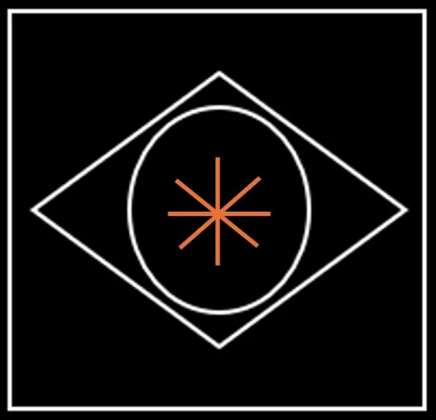

---

layout: base.njk
title: "Arete"
date: "2025-09-14"
tags: 
- Ragnarok
- Virtue
- Debasement
- Crisis
- Mythology
- Autonomy
- Anarchy
series Peridot
---

Artwork: *In the Blink of An Eye*: Insight that arranges equivalence to express complexity however that trinity of architecture is framed across latitudes *and* the longitude. Even without instrumentation they have a bearing through an eternal star - Polaris. Right here, right now, those with arete are watching the world wake up from history.

 

## Introduction

>Can't you see a giant walks among you
>Seeing through your petty lives?
>Do you think I do these things for real?
>I do these things just so I survive
>~ I Spy (Pulp)

Here, I introduce the concept of **Giants** (entrenched power, coercive and hard power) and **God** (soft power) actualized as individuals developing and expressing virtue or arete; through deliberate practice they achieve *autonomy* from giants and the machina animus*. Autonomy is as close to a freedom as is gets without the ultimate liberation of the soul from body. Autonomy is the capacity to do as you require to live well: be free from arbitrary and coercive authority) and their ability to perpetuate their control of you by influencing you to behave in ways that are *contrary* to your self-interest to their advantage. Your ability to understand self-interest  is required to sustain good health and to project that sustainability into Creation. Sustaining what you have with autonomy then gives you the opportunity to be creative *entirely on your own terms* - developing useful skills and attributes that allow you to appreciate and enjoy your life *as you model it* in the world and be an agent for positive change. 

Our autonomy is impinged upon by needs;  food, clothing and shelter. Their price (but not their value to you) is beyond your control. Within your command however is the opportunity to save a surplus to fund your future and so to secure your autonomy.

This was undermined in 2008 when the United States added a nominal 1.2 Trillion dollars to restore liquidity after a bout of malinvestment by institutions and individuals alike. Following this debasement the opportunities to invest in real-world yield bearing assets (known in parlance as value equity) was lost. This *debasement* has decisively undermined the dollar regime's credibility and legitimacy. In the aftermath protocols emerged to secure capital decisively beyond a hegemon's caprice. 

It is *globally* distributed and offers *any* regime the opportunity to secure productive outcomes for its people. Several are seizing this opportunity with effort to demonetize their regimes (by removing paper cash) as well as introducing unassailable identity assurance. Others are arranging themselves based on a confluence of interests.

***The giants and their Leviathan are o longer be able to impinge upon the autonomy of a person (unless they themselves allow it) because they have lost the capacity to arbitrarily assign a price for money (the interest rate). There is cause of enormous optimism as this has profoundly positive implications for our planet and the preservation of its ecology. No threat is greater to the environment than inflation (masked as money debasement).

This a commentary on ancient mythology that has resonance today - of self-styled giants on the one hand and the notion of monism - or God: those who possess the divine within sufficiently and who sustain, create and transform truth into beauty in whatever station fate has them in the emerging global reality.

**Arete** (ah-ree-teh) is an ancient Greek term that refers to excellence, virtue, or the fulfillment of purpose or function. In the context of ethics and philosophy, it encompasses the idea of living in accordance with one's highest potential, excelling in specific areas, and demonstrating moral character.

In Greek philosophy, particularly in the works of Aristotle, **arete** is central to his ethical theory. For Aristotle, **arete** meant achieving the highest form of human potential through reason and virtue. It was not just about success or talent in a particular skill, but about flourishing in life by cultivating good character traits, such as courage, wisdom, temperance, and justice. In short, **arete** means living up to the highest standard of your abilities and virtues, embodying the pursuit of excellence in all aspects of life. Arete involves:

1. **Excellence of Character:** Living virtuously by practicing good habits and making morally right decisions.
2. **Achieving Potential:** Striving to reach one’s personal best, in whatever field or role one is engaged in—whether intellectually, physically, or emotionally.
3. **Rational Action:** Acting in alignment with reason and living a life that fulfills one's function or purpose, as it aligns with human nature.
4. **Balance of Virtues:** Arete doesn't mean being perfect in a single aspect, but developing a well-rounded character, balancing traits like courage with temperance, and wisdom with generosity.

## Reality Bites

If you are to question authority with any degree of credibility its because you have a broad enough perspective to be utterly decisive in making the call; to harness the gathered momentum and reach decisively for your *Calling*;  you watched enough of information for a long time. What's changed is you. You're older and freed from the need to persist with the incumbency. Your debts to civilization paid in the form of self-aware offspring successfully launched. Meanwhile time bears down with the ultimate truth of your mortality. Your head turns up finally from the mundane and scarcity is made a fraud. So you pivot hard towards the prospect a virtuous reality and autonomy.

I was introduced to Arete by Kitto via Robert Pirsig in Zen and the Art of Motorcycle Maintenance. I came of age steeped in the social sciences particularly history, political science and economics. Then pivoted towards the *real world* and - finance and information technology - to understand , *in practice* rather than theory, how the gap between truth and beauty might be better minded. 

> He is in fact an excellent all-rounder; He has surpassing arete; an efficiency which exists, not in one department of life, but in life itself.
> ~ Kitto

This is important at key cyclical moments - turnings where capital has been debased. Historians derive considerable information about ordinary conditions for *common people* at certain periods by examining the alloy in coinage, measuring the *adulteration* of silver or gold and then assessing it against comparative standards of prosperity and well-being for different classes or 'professional' communities. Without the benefit of the broadly disseminated information we have today (the ultimate capital in any time and place) ordinary folk were at disadvantage. We have solved for this considerably by making market data for commodities freely available. However structural impediments or preferences still have these communities at a disadvantage. As well, of course there is the underlying unit (the currency) which some economic communities access directly by controlling its volume which unfortunately of course leads to inflation and undermines the autonomy of an individual (by making the ordinary details - food, shelter and clothing more difficult). As well the same networks which make commodity data available to producers accumulate an enormous quantity of data about peoples' habits. Data monetized in markets that analyze this to place product precisely when they are most amenable and susceptible to consumption. Subtly these peel away autonomy if order isn't cultivated with a consistent practice.

## Virtue (or Arete)

> Ἀλλὰ Ζεὺς ὁ πάντων ἀκουστὸς ἀνδρὶ ἀρετὴν ἥμισυ λαοῖσιν ἀφαιρεῖται, ἐπεὶ ἄρα δούλη ἔπειτα ἔλθῃ.
>
> For Zeus, who views the wide world, takes away half a man's *arete* on the day when slavery comes upon him.”
> — *The Odyssey*, Book 17, line 322

Virtue (a sense of ethics) is a key concept in human-centric architectures that aim to scale human interaction and cooperation to achieve meaningful positive outcomes. The aesthetic quality of the outcome is critical and virtue ensures that competition, a powerful impulse is aesthetically acceptable and that functionality follows only good form (efficient, elegant, and tasteful from *any* perspective). Virtue can be seen the practice of turning the competitive impulse upon oneself to cultivate meaningful growth. This is what the Greeks called Arete (Aἀρετή).

The idea expressed above by Homer *subtly* is that comfort over time invariably yields discomfort for those who enslave and exploit; not to mentioned the enslaved when the opportunity for the swift liberation of moksha (death) was there for the taking. It is a pox on houses.

For the victor comes the long Faustian bargain. They lose their autonomy incrementally by first surrendering the opportunity to express themselves as basic human beings; It begins surreptitiously as they demur on menial tasks, walking or the preparation of meals for example. Spoiled by their accumulated wealth they eat and live lavishly and ever further from the world as it is. In every sense they become removed from reality - how the world is and how people live in it. This carries across generations. Offspring inherit indifference, complacency, insouciance and callousness as much as wealth. The comfort derived from wealth evolves into discomfiture in plain-spoken company as indifference is reciprocated with interest, or rather disinterest (and disdain). This is experienced too by ordinary folk dutifully execute conventional activities yieldlessly (D.E.C.A.Y). Even as these, relatively innocent gather in their various communities, their indifference to the plight of the world leads to sporadic volatility and crude intrusions; they lack the smart perimeters of walled communities. All Inheritance is unearned by definition and therefore leads to compromise in some sense. Signal is lost even in the message of a lesson taught, *even* to the attentive because it lacks the insight of lived experience.

The titans are the celebrated. They are the *giants* who have accumulated capital and entourage. Their use of largess to delegate responsibility diminishes insight and they become systemically unaware. Soon, they are destitute of options to manage strategy because they lack vision in *almost* a literal sense.

Homer's tidy stanza above was expanded upon in a more modern myth, a novel by H.G. Wells in 1899, in *When the Sleeper Wakes*. In it Wells imagines a London where most people have become passive dependents on vast, automated systems and monopolistic corporations, while a small elite governs through mechanized convenience and economic abstraction. The ruling class and their technocrats live lives entirely outsourced to institutions and machines — their food, entertainment, decision-making, even moral life — leaving them spiritually empty and physically enervated.

Outsourcing human responsibility—both personal and civic—creates a form of living death. The masses sleep (literally and figuratively), and the rulers, despite their comfort, are little more than custodians of a machina fueled by animus - war and extraction - from both planet and human identity.

Never doing *any* manual or creative work. Their comfort is total; their decrepit frail bodies and minds dulled by a life of leisure and excess. They are incapable of defending themselves having outsourced courage, labour, and imagination — and in doing so, they lose their humanity and legitimacy:

> “The men of the upper world were scarcely men at all, but effigies of comfort, pale with inactivity and sated pleasure.”

In this world, the elite have grown dependent on their *machina animus*.  They live in a state of privilege becoming ever more infantile and delinquent. The delegation of work, entrenched and layered, they remain blithely unaware of its fragility; it's not so much that their system is prone to collapse but that they are impotent; powerlessly watching what remains of their brightest and bravest defect with ease.

The myth was retold from a different angle by Ayn Rand decades later in *Atlas Shrugged* with its own mysterious *sleepers* John Galt and Dagny Taggart. I encountered the book in 1994. Years later, such was its influence on me that I considered naming my first daughter Dagny. In the end a hardcover edition was my  gift to her when she came away from Western with an Engineering degree precisely so that she might understand *arete*. Finally in the real world, of course, we have Satoshi. 

## Entropy of Virtue

Russians have a term компрома (*Kompromat*), short for 'compromising material' which since the advent of photography and telephony *usually* referred to embarrassing information about an individual used to influence their behaviour. Previously one's *true* reputation was an aggregate assessment of credibility held within one's socio-economic *strata*.

This idea gets amplified and turned on its head once a money has decisively lost its mooring. The quality of a regimes money dictates the security and comfort if can afford. *De facto* when money has lost its foundation neither security nor comfort can be bought. More profoundly disturbing is that increasingly it is no longer available *de jure*. Judicial systems creak under the weight of codes defined to protect both property and person where increasingly the former has priority over the latter because giants govern and will always place theirs (if not themselves) above the rest. Disparities in outcomes become untenable and indefensible and increasingly even performative expressions of competence leave much to be desired aesthetically.

On the one hand there are those, call them giants holding tenuously to power and willing to do *anything* to anyone to protect their station in society while affecting what they believe to be positive change within increasingly limited constraints. They are heroic, loyal and virtuous, in their minds, as are we all.

The matter at hand however is heroic, loyal and virtuous to what cause? There are some who like the hobbits of Tolkien's Middle Earth perhaps, who want to be left to quietly live untroubled by the cares of the great world. Others, like the Aragorn (a nomadic eternal sleeper) who roams to assess the 'challenge' in his way away from the fray like Galt or Satoshi. He represents a chronicle as good in its way as an Oracle. A student of eternity, he has the knowledge of paths - those of least resistance and those of the most.

One challenge comes from his decadent libertine patriarchy a *Decay Ex Anima*; The arrogant, complacently corrupt Denethor II and decrepit Théoden who resist reform until it is almost too late. Flora and fauna perish and morale declines. The other from authoritarian and coercive challenging patriarchy of Sauron and his ally Saruman assert an I*mperium Ex Machina*. Theirs is a fierce puritanical vision shorn not just of sensuality but all empathy for either anima or its jealous cousin animus. Their machinations will whatever manpower is required, mass produced on dark production lines. This is an almost incoherent vision for us but it is one which Sauron intends for me whose decadence and appetite for opulence threatens to ripple across earth; and as well Saruman who now sets store on his own preservation. Together *Decay Ex Anima* and *Imperium Ex Machina* forge an witting consensus *Concordia Ex Nihilo* - a 'harmony of the nothing, by the nothing, and for the nothing'. This is a power with which nothing *can* live. It is the quietly dull and delicate malice of pure idiocy. It is bought and paid for with a zero-coupon bearer bond of paper called the United States dollar.

Aragorn's peers Boromir and Faramir at Gondor have virtue, loyalty and heroism in spades but lack the ranger's broad scope. It is all periphery all the time. He already know what the core has become - dependent. Whereas Legolas lithe, mobile and ethereal of the long lived Elfin, is a stalwart ally from a tribe with broad insight. The hobbits and their dwarf cousin Gimli are good humoured connoisseurs of merriment and persistent stout journeymen. The three who dwell in forests, mountains, and hillside homes close to life in all its forms add anima to Boromir's strength, steel and aesthetic authority; which he must finally and reluctantly relinquish to his more subtle brother, captain and king Aragorn.

There will always be an Aragorn. That *is our hope*. He represent the *eternal* faith rather than a literal truth that life matters and is good. What sets the Fellowship apart is their sense of mortality. They will die - that much they know to be true - and it is *the* defining quality of all that lives. However long or short, life may as well be a journey worth taking. This sort of thing is spoken and written so often as to have become trite and worthless. It can only be understood viscerally through a life lived and survived close to the very edge for it to be absorbed and ring true in action. Which is why so many of us are drawn addictively and tantalizingly close to death in all its forms as a preoccupation even in leisure.

The uncompromising quality that sets Aragorn apart is vision borne of observation and the quiet introspection. When the time came the Fellowship emerged as coalition of the willing and bootstrapped; those with sufficient courage and intelligence to *refine* and reset their loyalty as they gained data. Those with enough patience, humility and skill to challenge and bolster Aragorn's *primus inter pares* leadership as he himself does them to lead a quest against barbarism to end it for all time in the fires of not man but of *Creation* itself.  It is the quiet corruption of the ring that is a barbarous relic - an shiny ornament for the Raven and ravenous. However the shards of Narsil, alloy and capital well-used but poorly handled by the cavalier Boromir cut. It is *true* legacy *still* operational.

This is *arete* - each in their station leading in their way and their argument becomes an irresistible rallying point and leads to the fall of the machina animus - and its veritable production line of monsters. For all of Aragorn's vision the one thing he *knew* to resist was the poisoned chalice of that barbarous ring. He preferred the functional - the shards of Narsil forged in fire, our first technology, and our first penetrating magic of plainer men and mettle.

Over time compromises accumulate. Underlying culture entropies as property, again prioritized before personhood is valued and priced as *capital* and imagined in ways that appear ever more removed from the basic realities of food, clothing and shelter that concern the vast majority of humanity. 

Those who question the legitimacy of incumbent institutions and the Sovereign understand that priorities have been compromised and that as a result, value as a concept denoted in relative terms 'as the price one pays' and its accumulated legacy of culture or ultimately it's kernel of core truth, that which constitutes our values, is being undermined by the society in being continuously be generated (the constant churn of the series of transactions that constitute society and civilization. What has happened is that priorities have been 'flipped' so that those things traditionally priced the least (i.e. of low real-world value) are now exorbitant and those priced the most (i.e. of high real world value) are exceedingly affordable. The most obvious indication is the perpetually inverted yield curve as the price of money itself is fundamental distorted such that it no longer pays to save or build things which are long-lasted or even worth building at all. 

The thing forever worth building and investing is oneself. One's identity, personality and capabilities - the Stone Rose. The thing most prized of all by those with virtue is autonomy which once priceless is now firmly in sight. Seeing this, the virtuous seize the day to live the life they dream of - without the repression and coercion of arbitrary authority.

We are all geared towards self-actualization: reaching our full potential or being the best versions of ourselves. A reflection of this self-actualization is the esteem with which we are held by others - positions of authority and prestige. Problems arise however when the positions *themselves* become our objective in life. Unhelpful are the trappings - the perquisites, privileges and courtesies of office and the those that follow. 

The myths recollected above belong to the turn of the twentieth century as industrialization accelerated and the trappings of  comfort were extended to ever larger numbers. These were dark times on the eve of the humanity's most destructive conflicts that were underlined with the massive and indiscriminate destruction of human life.
