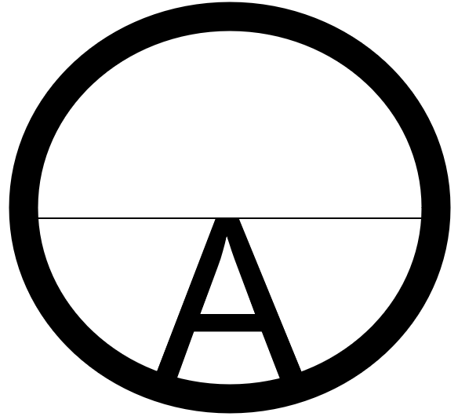

Artwork: A path into the horizon and its *bounded* reality. Life happens, one becomes self-aware, introspects and then introverts to find *Calling* and in this finite and divisible world manifests a miracle to create something that is new. 

## Introduction

If intelligence — expressed as Anima — is the blueprint for legitimacy (and what is more legitimately reasonable and beautiful than our ecology - the natural world without animus?) Then *capital* is its vector in the material world for humanity to replicate the order perceived in the natural world: the current which flows as the distilled codification of trust, the manifestation of collective purpose, and the medium through which creativity, labor, and cooperation transform potential into realized abundance without needless toil and spin. Misapplied through sub-optimal decisions at either level (individual or sovereign), it mirrors the failure of intelligence: destructive, extractive, and ultimately unsustainable to Creation. Applied wisely, it is the signal through which self-sovereign individuals and communities (including their aggregation as nation states) coordinate, flourish, and align with the emergent order of life itself. ***E Pluribus Unum*** extends the conversation we began in Sin Qua Non to discuss the qualities of good money (capital).

## One

>Is it getting better
Or do you feel the same?
Will it make it easier on you now 
You got someone to blame? 
~ U2 (One)

E Pluribus Unum - From one, many. From *within* one world we are capable of apprehending the infinite with our faculties - our minds and bodies. That is as scarce and productive as potential can be. The matter at hand is whether we see our potential and use it well or squander it. Which amounts to which even is for oneself and no other to decide;  that is the power of autonomy - when self-mastery becomes us. We become adept at doing things and then increasingly shrewd in knowing what to do and what to leave alone. What to have and what to deliberately, intentionally go without and leave alone as the priceless unpaid companion; a songbird in the bush.

A sense of scarcity will encourage you to either save a thing or hoard it. The distinction comes from how you perceive creation. Is your ecology - the world of things beyond your body - something that already belongs to you. Perhaps something you have been given custody of or is it something something which you have yet to somehow take and make your own? Are you a world conqueror or a world saviour.  

Our ancient ancestors took from creation to eke out a semblance of comfort before *property* was modeled. Our first nations in the Americas manifested civilization - something much more than bare subsistence without *any* formal notion of property. I imagine them facing the 'hostile' elements with a determination that was not animosity but rather a conviction - a willfulness before sentences were ever spoken or written, leave alone passed on free men on open land by magistrates of the king. It was a posture stood up like defenses which ranged outward. As if to say, 

> Creation, I take from you today because *your* survival requires my patrimony, my ways, to continue. For I am your custodian not master. I am but a child and am yours - and as your child I will take from you freely *only* insofar as I require to keep me and mine safe and warm and no more, I swear to you.

Once comfort was safely brought home the posture which in truth was ***anima*** universally extended and exercised precisely without trespass, settled. What had hardened was now set loose - sinew, breath and gaze eased and lengthened while voice turned inward to introvert. In stillness and quietude something was learned within of what had passed. Knowing looks and wry smiles are all that told around a hearth still held whose flames danced all to calm slumber so awaken with the sun once more in the morning.

Only the callous indifference and cruelty of another *man* tempts the ***animus*** within us to rear its head. This is a sustained indiscriminate inchoate hostility that only humanity expresses in measures small and large towards that which it will not understand and cares not to because the time for caring (and minding) has ended. 

The irony is that such is our *empathy* and love for that which is of our own that we may lash out with an animus borne of it towards ones we might otherwise have related to or even loved: Even the most beautiful, sensitive, rational, poetic, intelligent and sublime ones - simply because we have accepted the generated imagined collectives of 'us' and 'them' of those who claim to lead impossibly large and diverse groups which we are now rallied and called to love as our own. 

For these 'leaders', 'winners' and 'drivers' - these champions of all that is high and mighty - and their ambition (and that of their children) we have made those other beautiful ones foreign by turning them away for a mere utility - a travel document. A passport and the cash carried with it. As well an unforgivably high standard of permanent disparity. Which is to say any disparity at all.

This is war even when it is conducted by other *mercantilist* means. It is Indiscriminate violence perpetrated by the *very* *strongest* upon the 'other'.  Ask the question: If they place themselves above all others and follow no one then *what* do they follow? What are their values. What price will they sell a thing and how is that price to be denominated? 

This is how the United States dollar lost its legitimacy. It failed because it became too tempting an instrument to be used against *any* adversary in *any* domain through executive action - behaviour which continues unabated even now. It *was* to be a vehicle of persuasion - a legitimate *transparent* instrument of tender for consideration. Instead it became Tolkien's one ring to rule them all Or at least ensure survival and comfort - even if it means that a growth spreads wildly and uncontrollably - sown on the endless fruitless toil of weekend weak-end humanity.

## Follow The Money

In society we rally to our institutions and symbols and seek to preserve them when they and their agents (our servants and delegates to them) express plainly that they are aligned with some greater sense of meaning or purpose than those institutions or their sovereign. The sovereign cannot in any sensible world be final authority on matters what is to be.

**FIX**

There is only one thing greater than our institutions and on this there is overwhelming consensus: Creation or if you prefer, the ecology or environment. There is no need to engage the sophist in an argument on these terms - that is a plain is a plain distraction. All I mean to say is that we are destroying this planet. 

. If they cannot preserve creation nor recognize that they are failing it and therefore, not just humanity but all flora and fauna. They will express animus towards life in increasingly indiscriminate fashion. 

to save when our institutions and symbols are imbued with meaning and value - and the incentive encouraging us to save is yield. When you no longer trust the yield derived from holding society's symbol of value (currency or things measured with it) you are now saving by 'other means' and are foregoing that yield - you are now hoarding (usually gold). This is why [Keynes](https://en.wikipedia.org/wiki/John_Maynard_Keynes) called gold a barbarous relic and [Friedman](https://en.wikipedia.org/wiki/Milton_Friedman) cal led inflation a monetary *problem*. When a money breaks, you find *your* best alternative. A money that works *demands* of its holders a price - yield. A money that works comprehensively on Earth expresses wholeness *and* allows the expression of yield that expands and contracts without hindrance otherwise people resort to hoarding gold - the one form of money that is not a token, but rather the scarcest stable element on earth. So how do we ensure that yield doesn't break?  We incentivize fiscal and monetary discipline and rectitude in those who govern money through competition; allowing currency to operate on credibly neutral decentralized architecture (e.g. proof of stake denominators) that permit the expression of relative sovereign yield. This provides a *stable* universal foundation for free markets - a necessity in the transition to a post-hegemonic world in which power is wielded with multipolarity and asymmetry. It also paves the way to the reconciliation of pluralism and collectivism in our world.

**Wholesome -  Reconciling Pluralism and Collectivism**

The symbolic representation of the world's abundant wholeness is expressed by the 'O' in the image above. 'Looking out' at a horizon of limitless potential that is yet within a whole, we track a course along a path that comes into clarity with each decision, collecting capability, skill and reputation, but not always discerning ultimate purpose. At some point looking back at life, and through introversion, at an image pixelating into fullness behind us, a 'Call to Adventure' and with it, an abstraction of identity and purpose emerges and we continue life with clear vision. *Together* we're on a path in search of *alpha -* in the aggregate for the planet not just in the notional, but also in the material sense in a way that doesn't debase either.

As we look to a horizon of infinite potential amidst our collective (and distributed though we may be, we are still all ultimately one *wandering* *tribe*) we see a path without obstacle but only if we have the imagination to see it. Life on earth has not been easy and the path has never been straight; it requires a willingness to govern by those that lead their tribes and have earned the right to do so by expressing and continuing to express self-evidently *productive* creativity - taking risks to be sure but with the strongest leading from the front with clear vision not blind hope; collectively, there is a requirement from global governance leadership to provide for a *foundation* of structural integrity with secure channels to manage adversarial potential so that we may all thrive.

From a mathematical perspective starting at 1 and looking back at 0 gives you a completely different perspective on reality. Because the space between those two is *infinitely* divisible and the question at hand is what kind of behaviour dictates how it gets distributed among us. One that hoards or one that saves by sharing? One that creates or one that destroys? What is your perception of productive behaviour? To make guns or butter? And now we understand you and *your* idea of abundance.

**Kings of the (Military-Industrial) Stone Age**

[Bitcoin](https://bitcoin.org/bitcoin.pdf) expresses the theoretical and mathematical *idea* that '1' is infinitely divisible in digital terms (0 1) and that it should not require us to be 'brought' together to be governed by a single material entity - which is and has always been the hegemonic quest of imperial power. The ultimate number of bitcoin is supposed to be 21 but that's irrelevant for this conversation - the point I'm making is that a bitcoin is infinitely divisible. Unfortunately this idea is not reflected in the world as it is with 193 states and two other entities (the 'State' of Palestine and the Holy See) that scramble for a share of the world's wealth on our behalf. Bitcoin is essentially (i.e. virtually) a machine whereas we are human. And yet it has still accrued enormous value relative to the default global reserve currency (the United States dollar) since 2008 and costs (i.e. inflates) merely 3% a year to run (which comes at the cost of externalized outside the machine (i.e. those who do not use it). So we may as well, let it set the 'risk free rate of return' and all those in governance can 'retire' *and* continue to collect their salaries; and even that would require all of us to accept it. And we won't because it has merely automated the idea of *humanity's governance by machine* (while inflicting an environmental cost on the earth).* As I have written elsewhere until bitcoin (and all proof of work) mining is financially unsustainable to those who do, it will remain a mechanism for dollarization or de-dollarization for those without the ability to 'create' US dollars (i.e. outside the dollar regime). It is and will remain an effective monetary weapon of defiance against the dollar regime (hence the phrase 'roubles' for our friends, bitcoin for our enemies).

Meanwhile what of the governance already in place by those 193 + 2 entities? Whether they collectively create or destroy capital is anybody's guess and entirely subjective; but it evidently entails enormous cost in blood, treasure and future potential; and the lives affected in countries rich and poor alike are those of innocents and the relatively weak (women and children). Meanwhile the strong, talented and brave are made to wage war against merely because we have someone to blame (namely, the 'other') - the tired trick of politicians on the hustings bereft of real ideas. But are things getting better? Will it make life easier? Or do you feel the same? We are each entitled to our individual assessment. You may make yours and I will make mine;  I think we could do better. Going back our discussion in the [Prehistoric Ledger](https://transition-insight.com/f/the-promise-of-blockchain-and-ai-the-prehistoric-ledger), there is one nexus that is as problematic today as it was in prehistoric times: The approach of the *L'Étranger* (xeno); In a modern world, that is one interaction (to shoot or ask questions) to be handled with extreme care and transparency between those delegated to lead their tribes otherwise they will inadvertently lead us back to the stone age.

A government's policy is expressed through law and dictates its posture towards people (inside and outside the polity); it is largely dictated by the expression of non-fungible power (influence and cash money) by private entities (corporate or otherwise) to influence decision-making by those who have it naturally to their own interests - and it is largely opaque. Eisenhower's warning of the Military Industrial Complex is to be heeded - they are post-modern kings of the stone age.

**A Quest Called Tribe - The 'Smart' Contract**

Human-centric governance is necessary and humanity needs to dictate to a machine the outcomes it wishes to manifest collectively. Machines (virtual or otherwise) can count but can't tell proverbial guns from butter. Hence the need for governance (Layer 0) to manage and allow for the construction of credibly neutral [protocols](https://ethereum.org/en/whitepaper/) that allow data (including money) to be allocated productively and sustainably through the unencumbered and unimpeded expression of relative yield.

Think of those 193+2 entities as 'tribes', each led by governance (leadership) delegated through whatever means they have determined to be optimal given their level of relative developmental sophistication. Leaders gain legitimacy by allowing capital to enhance productivity and improves life for their people. Whether it be corporate or otherwise, leadership in the so-called '*democratic*' west has an obligation to constituents for transparency given the degree of delegation issued by their people and by claims to self-evident legitimacy. Leadership demands impeccable integrity; transparency concerning the receipt and distribution of capital and data is an imperative for all in leadership - those with access to power (capital, influence, or authority) public or private. These express credibility to partners and allow a path to collaboration not adversary - we and they are interested in free and open markets after all and an extremely high-bar must be demanded before resources are committed to conflict. Both capital and data must be allowed flow swiftly and securely between identified (i.e. KYCd) individuals at a cost approaching zero so that it may be optimally productive.

The prize is enormous but difficult to secure given the enormous complexity entailed in the body of law written over decades reflecting accumulated *compromises* made over time to disparate constituencies. This is *legal* technical debt weighed down by countervailing technicalities that 'split the material difference'. Another word for law is 'code' and as in software development, pressed for time and with prevailing 'architecture' difficult to transform legislators choose the *apparent* path of least resistance continuing along the path of code complexity, which comes at a mounting (computational) cost - interpretation of law. The solution comes *via negativa* - to parse code down to what is required (its intent) beginning with the most basic contract of all - legal tender - and allowing its relative value as expressed by yield to be computed based on productive (constructive) allocation.

All contracts are ultimately subject to a *basic* law. When we try too hard to make contracts function for everyone (i.e. in every context) we start to make our laws complex or inadvertently compromise the basis of our law - ethics - which *should* be immutable (always contextually valid). That is why you cannot separate ethics (Religion) from government (Law).

Sound laws require a simple foundation that allow outcomes that are credibly ethical (neutral at worst to any stakeholder in the polity). That means that *every* contract subject to law at a minimum *must* be compatible with the intention of expressing objectively valid zero sum outcomes for all (in economic terms it does not create negative externalities borne by the commons - there is no cost over the long run and whatever cost incurred approaches zero). This 'complex idea' is fundamentally reconciled with a basic one: If you know the difference between good and evil you have *no need for law*. All that is required to *nudge* the collective towards prospective self-governance (I call this anarchy) are the appropriate incentives.

In the modern world having credentialed leadership moves us collectively towards transparent market mechanisms because it *chooses priorities exceedingly well.* The fundamental challenge in capitalism is *true* price discovery; the determination of an *ethical* price for things in the world - namely one that *works* for all people at all times and in all places with objective variability (arbitrage). It is a profoundly difficult problem to solve for but an *objective* answer is that it does not lead to the destruction of *value.* Subjective value may require you to destroy things in the short term to generate 'comfort' but the more subjective (arbitrary) your definition of comfort is the less objective it becomes for others because it is to their detriment (and yours) now and into the future; our resources are finite in practical terms. This requires a rare skill - common sense - and its scaled equivalent - shrewd judgement that is comprehensive in scope and abundantly *transparent* to others. What is required are credibly neutral secure nodes (in the analogue and digital).

**Truth and Utility**

The motto of my [alma mater](https://www.uwo.ca/index.html), the University of Western Ontario, situated in London (the Ontario city roughly the size of Tulsa or New Orleans), is *Veritas et Utilitas.* Whatever else I learned in school, and I have a rich education, understanding those three words are all I will ever need to live my life with purpose; to know myself, apprehend reality, and then to be of utility as I seek to change it for the better. Arthur Kroeger (one of Canada's finest civil servants) spoke at my convocation ceremony in 1991. He also served as Chancellor at [Carleton](https://carleton.ca/) while I studies International Affairs at the [Norman Paterson](https://carleton.ca/npsia/) School as though a mentor watching my development; his journey through life and passing in 2008 are meaningful to me. His (Mennonite) family came to our country from the Soviet Union to *avoid* conflict and foster community. You have likely never heard of him but he is nevertheless a giant in my world. He and other leaders quietly express legitimacy by articulating policy that aims to find a balance between a commitment to historic partners, and reaching out to build transparent bridges to potential ones. We are peacekeepers and have deliberately surrendered home-grown military capability (nuclear and aeronautic) to instead exercise [*soft*](https://en.wikipedia.org/wiki/Lester_B._Pearson) power to prove it. We work for our constituents, and define that term broadly, regardless of whether they pay our salaries directly. It's how those who lead and govern claim legitimacy.

*For the Bitcoin maximalist: Remember, Satoshi was cypherpunk so you need to think like one to understand why governance matters. 21 Bitcoin (don't let the million throw you off - remember it's *infinitely and equally divisible -* it might as well just be  21.000000 bitcoin as well as 21,000,000) is only half the answer to the 'Ultimate Question of Life, the Universe, and Everything' (the question the Earth was built to ask); the answer of course is '42'. Bitcoin is a virtual machine - amazing - but still a *only* a machine. Don't get all 'Skynet' on us; you still need legit (identity abstracted and integrity assured) humanity and a healthy planet - not just to pose the question, but to fully answer it.

Put another way, '21' is just a game. To be a player in the real world takes a 'black' jack of all trades; multi/cross disciplinary capability, numeracy (so complex as to be linguistic) and as well virtue - an ability to select right action in context; in a word - *arete.* Yet it still leaves an element of risk (thin tail most of all) which requires you to settle all dilemmas with governance that has legitimacy (i.e. derived from consensus). Chaos and anarchy (peace, order and good governance) are not the same.

*City (for me at least is something approximating those that I've lived in - London (England), Toronto, Ottawa, Tokyo. I'm not sure where the demographic and geographical demarcations are but they involve outsized cultural significance. I have particularly deep and abiding affection for London and Toronto. They're not for everybody (thank God) but they are my 'hometowns'. I've spent the whole of my career in Toronto - consulting in practically every notable tower in its downtown core and IBM's campus in Markham. I think there's something special about Toronto and Ontario generally that deals with the nexus between humanity and the evolving technology given Anglo-Saxon's dominant role modern culture, its modernity, its secularism and its multiculturalism (particularly with respect to idea of 'joins' or nodes of relative neutrality). Seminal moments in blockchain and Agile/DevOps happened here and ideas emerged to manage risks and opportunities to to derive optimal value based *perhaps*, on negotiating a tricky path of entanglement between an old and a new hegemon - A bizarre love triangle. On the one hand, its desire to forge an independent destiny reconciling  imperialism at home and on the other complicity with expressing it away from home.