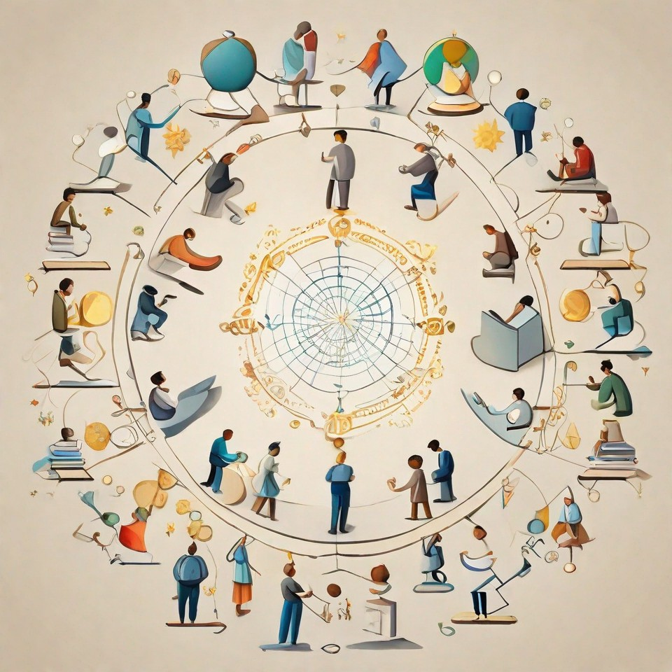
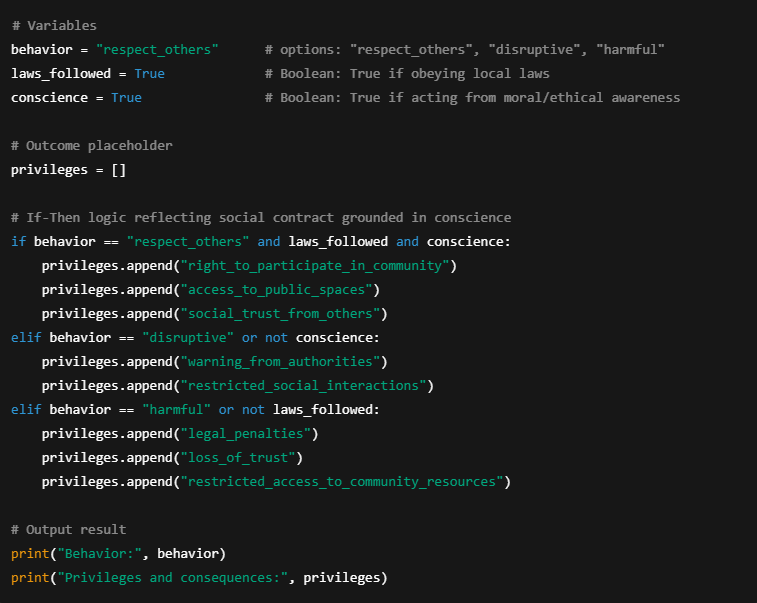

**Contract**: The word has the sense of wheel or weal. It is how we, together (con~) cover ground (*tract*) to create wealth (a sum positive outcome for *both* parties - i.e. you and them. Hence the terms wealth and commonwealth.  In practical terms there are only two parties to a contract as far as your concerned. Of course in a liberal society we are free to abstain from contracts that do not appeal to us. The social contract however is accepted *implicitly* by (being alive - i.e. possessing the quality of liveness.

## Introduction

Part Two of *E Pluribus Unum* explores the concept of contract — and in particular, the social contract, which governs how we agree to behave in society. Part One, *Leviathan*, examined what passes for leadership in Western liberal democracies: how it is constituted, bounded, and positioned relative to the rest of the world. One unspoken mythology of Western democracy is that of meritocracy: institutions, it is claimed, operate within a system (capitalism) that automatically elevates the most capable individuals, in a free marketplace of ideas rigorously examined by attentive citizens.

In practice, this myth collides with the reality of governing large, complex nation-states. Processes must appear to function consistently, yet scale and complexity make this impossible. Rules and strictures are imposed at considerable cost to ensure disciplined procedural oversight, while allowances and exceptions are made to keep governance manageable — often undermining that very oversight. Compounding this is the imperative to maintain the prestige, esteem and security of officeholders and institutions in a competitive, adversarial global context. All of this serves to cast leadership as a coddled coterie rather than a representative meritocracy.

The result is a growing separation — a psychic distancing — between the state (Leviathan) and those it governs, producing an inevitable erosion of trust and legitimacy. Surveys, such as those by Pew Research Center, show that public confidence in both public and private institutions have steadily declined since the 1950s. While few doubt the good intentions of senior leaders in public or private institutions, systemic compromises and fiduciary pressures create mounting tension on the social contract — the implicit agreement about how we treat each other. Broken promises, particularly the idea of upward mobility — that diligence, curiosity, and creativity will be rewarded — highlight the contract’s fragility.

Yet there is an adaptive mechanism built into society: a kind of dialectic in pluralist systems that allows innovation to persist outside incumbent structures. New ideas can then diffuse into the social contract, enabling governance to evolve — or, as I suggested in Part One, devolve — outward from the Leviathan to the periphery, ultimately empowering individuals to govern themselves without permanent intermediaries.

This second part explores the qualities of a well-functioning contract: one that executes processes consistently, predictably, and without bias. Such contracts — particularly those capable of operating autonomously, on-chain, or algorithmically — may be central to the devolution of governance to the self-sovereign individual. As well they are critical to the long-term resilience of human civilization sustainably on our planet.

## Cum (Together)

>Lift me right out of this world
>Trip me, won't you won't you trip me
>Won't you won't you trip me
>Lift me ride me to the stars
>
>~ Primal Scream (Come Together)

Contracts are created as a utility (an instrument or tool) to allow complex civilizations to flourish. The word is derived from Latin. The prefix *con~* from *cum* (meaning together) while the term tract is from *trahere* meaning to draw, pull, drag. So a contract is a means for us to come together to gain traction and manifest a sum positive result. Something greater than what we might have achieved separately. Contracts are creative and in a practical sense they facilitate generation, productivity or if you will, fertility; you will note the synchronicity drawn from the primal reality of life's fundamental attraction. This idea extends into the rest of our life and it's why the discovery of one's *Calling* is important; turning us from the anguished scream of repressed identity and instead to truly productive outcomes.

Legal contracts are drawn up to stipulate explicit terms: “If this, then that.” The structure is conditional, encoding obligations that arise from an envisioned opportunity, which in turn enable the enjoyment of rights. There is a clearly defined cause and effect. One thing precedes and results in another. 

**HERE**

But this *if/then* logic extends far beyond the legal domain. It describes how all systems — social, ecological, moral — maintain coherence. Laws formalize it through enforcement; conscience enacts it through awareness. In both cases, the “if” represents the initiation of will or circumstance, while the “then” measures alignment with justice, balance, or integrity.

When conscience is excluded, contracts become purely transactional — efficient but blind. When conscience is included, *if/then* acquires moral depth:
 If an act sustains creation, then it is lawful in a higher sense;
 If it harms, then it violates the deeper contract that binds being itself.

Thus, the true contract is not only between persons or states but between human will and the order of life — between action and consequence, cause and meaning.

The implication for a *social* contract is that through our connectedness to each other we lift and ride with each other out of the world in its bare original state to derive comfort* (which means 'together strong' if you analyse the term for its etymology in Latin). we need to live well enough to pursuit contentment; whatever fate allows in our circumstances based on what we are afforded by each other. Intuitively this should make sense to you as you look around. The heating, lighting, the building you are in keep you comfortable and you are unlikely to have been self-sufficient in the provisioning of these. As well throughout history, the breakdown of legitimacy or the social contract is made evident by the failure of basic processes or utilities long taken for granted: electrical failures and water shortages for example. As well the definition of a necessity appears to fail basic rational tests in a flawed system design; the panic over toilet paper remains a luxury for a large number on the planet - and one which is increasingly indefensible from an ecological perspective. These are red flags for those who assess security and risk at macro level. From a systemic (holistic) perspective it is actually insane. The intuitive loss of legitimacy suffered by the system (sovereign) is reflected by Krishnamurti:

>It is no measure of health to be well adjusted to a profoundly sick society. 
>
>~ Krishnamurti

Social Contracts have two interrelated components: the law provides and and social norms.; one . The other one, implicit, are social norms.

The Indian philosopher and ethicist also intimated that observation needs to precede judgement

and judgement and that the entire experience of life was an education from the first minute to the last. We are apt to fall in line, guided by what passes for 'social norms'. Contemplatives however speak of a beginner's mind and understand that we *filter* information through a set of assumptions and perspectives. Thought may be rational but it is always *subjective*.

**HERE**

 If we understand that we have but one perspective with which to think, we continue to observe and gather data to see how others operate 

As well they are agreements, not necessarily of course explicit, specifying outcomes contingent on *obligations*. We will often talk about 'right and obligations' as though they arrive together.  

**HERE**

but in reality one precedes another; obligations precede rights. Now we may hallucinate or model our reality differently if we're not careful. For example, simply by using the term 'rights and obligations'  and placing one before the other can effect our expectations in civil society. 

Think of a society, not as complex as ours but still orderly and structured. Those of our indigenous communities. Or the first societies which formed; ones with *implicit* rules rather than the explicit ones we have today (i.e. law). Obligations, except for the very young *always* precede rights. For example you cannot claim a *rightful* share of gathered and hunted victual without first having participated and asserted *some* talent to express the feeling that you want to belong to a community. Invariably you will introspect on what that may be as you scan your immediate surroundings to find a gap that needs to be filled; a reality or truth which needs to be adjusted to align better with what your nascent community requires as it seeks comfort.

Now, it doesn't help that in our discourse the term *rights* literally precedes the term *obligation*. But at the minimum we seem to believe that both

Similarly in software development, we have have conditions which need to be met in lines of code

While the equator provides an objectively geocentric frame of reference in the physical world between north and south, it is the psychological axes that dominate our geopolitical realities and this has been true since the very beginning of civilization. Now, recency and personal biases affects our opinions. For example my own biases has it run through Greenwich (London). However in reality

 there's only one axis that counts. It runs up the Nile from Lake Victoria and the nearby Rift Valley where human civilization began up the Nile to the first civilization to scale to enormous complexity

Our reality pulsates and radiates from the these axes.  and one dominates completely. oThe first 

 Paper contracts such as the US dollar have been used in the west since the invention of papyrus in ancient Egypt over 3,000 years ago. In the east 

It is a token of trust in the government that creates it and administers its distribution throughout what's known as the US Dollar Regime. What this means is that it is not just the currency of the United States but rather purports to be a utility for a world based on a set of values; two primarily: democracy and capitalism.

On it you will find the word 'In God We Trust'c

Those are sacred words - so too ‘In God *We* Trust'. There is no ‘US’ in ‘We’ and gazing back from the azure God only sees us.

Money is a technology and *we* (all of us together) need to evolve with leadership that acknowledges our oneness by building a platform that fosters global partnership and collaboration; any competition is ultimately about our better angels constantly seeking a new personal best.

*Transparency* will separate a technology that does harm from one that does good. Only a technology that draws a strand that traces from the ‘one’ (our private key) to ‘many’ (our public key) securely will work. America must lead because the 'spec' is on the 'specie'. And brevity being the soul of wit, America gets points for style - but really needs to pick up the pace on delivery and execution. As things stand, however, the global hegemon is on ground that still tremors from the echoes of the Great Financial Crisis of 2008

**The giant that walks around you seeing through your petty lives?**

I found David Graeber’s [Debt](https://www.amazon.ca/Debt-Updated-Expanded-First-Years/dp/1612194192/ref=sr_1_1?crid=M88AXWO6CZ00&dib=eyJ2IjoiMSJ9.34MX0YDZZuKCoeWBbYLUZijFli7S1i0v1CtE8HSDy1ZZLThc5uMukpva8WEKnAWeP7A3SYaFRkPeSEWfvGDftYJ0RNhNQeOsWiFaL-3PN8RNq-QeGOC1nRqKbD1lxhpgJpHmCZsIV6xfgXN0P6ZfPh-yjlNfYm7rDG2w_sFgb3hHSDwJB-DEq17yP7O0Riii8z8Mp_weju_XauNPPM88I3kuK_aj81qVir2v1fZ3Mj8.XGlm0Mo30mIC_wNGCMxquKIP55vy6zCJT1ZXejkBTa8&dib_tag=se&keywords=debt+the+first+5000+years&qid=1716773287&sprefix=debt+the%2Caps%2C215&sr=8-1), which I referenced [earlier](https://transition-insight.com/f/the-promise-of-blockchain-and-ai-the-prehistoric-ledger) in the aftermath of the Great Financial Crisis and the emergence of Satoshi Nakamoto’s [whitepaper](https://bitcoin.org/bitcoin.pdf); it circulated widely  in the emergent crypto community as a backgrounder on the nature ‘money’ - which we use daily without much thought. 

I came to it because weirdly the question wasn’t addressed in my otherwise comprehensive education - which included an excellent Master’s in International Political Economy. We should never get so far before understanding money - because our misconceptions about it lie at the heart of our problems in life and our complacency on the subject of money is so comprehensive as to seem induced - almost *‘manufactured’.*

The problems stemming from our ignorance compounds in our lives and in our society over time to the point at which the subject becomes a matter of public discourse. The  first, lazy and instinctive thought is “conspiracy!” But as Kahneman points out even elite undergrads struggle with this basic arithmetic: 

*A bat and a ball together cost $1.10. The bat costs $1.00 more than the ball. How much does the ball cost?*

If this has the best of us stumped because we don’t stop to think. Then how much more thought is required to understand something so arithmetically complex as the global monetary system before we stop jumping to the stupid conclusion that periodic systemic money fails are caused by hoarding globalists?

It’s a tragic tradition that points a finger at those living by the tenets of a simple idea: *time is valuable and needs to be priced - and paid for*. It’s a problem that we grapple with in our oldest ethical traditions often badly because we struggle with defining the *objective* point at which this legitimate idea of lending capital becomes *usury* - a sin but one too loosely defined.

But in a world of accelerating disparity between ‘Have’ and ‘Haven’t’, Pulp’s [anthem](https://open.spotify.com/track/0NWnWSkFT6p01JDgmQxbTT) from which the subtitle above comes, strikes an angry chord and induces righteous anger in the souls of common people. They look to the sovereign for answers.

Leviathan in turn seeks to [grab](https://en.wikipedia.org/wiki/Executive_Order_6102#:~:text=Executive Order 6102 required all,in 2023) per troy ounce.) what we in tech call a ‘honey pot’. If it fails it does so only because the honey is spread widely - *decentralized*.

The tragedy of course is when the honeypot is squarely in your sites because of 2,000 years of wretched [hate](https://www.worldjewishcongress.org/en/news/a-third-of-nazis-war-effort-funded-with-money-stolen-from-jews-study-finds) -  and centralized. 

But Pulp’s anthem resounds with optimism in end - if we can rouse ourselves to the insights required to make a transition to something new:

*“I spy the chance*

*To change the world”*

**All Structures are Unstable**

Stable architectures are secured by multiple struts distributed widely - bridges, arches, buildings - they avoid single points of failure. Cross-disciplinarity helps with the examination of the problem and we have an internet that resembles a dilapidated unstable building with all the appearances of security and privacy - one rife with opportunities for exploitation. *Only murder in the building*.

but this is now an information technology problem because we exchange value increasingly online - and online, beneath an opaque surface new source of value (data) is not only not fairly distributed to its creators and owners (but hoarded by the few - some well-known and our solace here is that they are for the most part *relatively* fair-minded and competent - the pair I like to call ‘Truth and Beauty - Microsoft and Google for example.

Online our monetary reality is generated through the confluence of our personal biases which come together to construct, escalate and amplify a transactional framework that is opaque - fundamentally a black box devoid of transparency. Offline, at least the aware among us have the ‘[Gift of Fear](https://www.amazon.ca/The-Gift-of-Fear/dp/0316235776/ref=sr_1_1?crid=3EIMS4PTCI6IQ&dib=eyJ2IjoiMSJ9.DC9BZ2S6bYx1A1hmkETx16M_GMPG3oB55uiGVCyYb39cL0gK2RXOuBpiyLCiA6K4TBI_bRbYgeQjUgE1hwoM-ZuJmg3srv_wn_qPJedp5Y51UNCl0jtwoNGku3Xoc23iOphLmcRUGURannSqbusJ_8a6eBmJWFi-4pxR-ul7EmaTLOcQYl8kedEEyIiaQqkrxUKKmJ6VfEwhNnuPpQWVNbpkghuf7NlJ_YJgMM7V0w5tbny_CQ9srRteGDAuE2fahjJDOzlu3_zq9TNElMxXQVzGbO1-S9R5oyEYO7NMnEE.8DdkAX0YUiWGeBolHuRpN8eGX8wcEObBNsBTAjW3XsA&dib_tag=se&keywords=gift+of+fear&qid=1717434387&sprefix=gift+of+fear%2Caps%2C88&sr=8-1)’:  “*senses working over-time trying to tell the difference 'tween the goods and grime, turds and treasure"* and ultimately separate that which gives us pain from that which gives us pleasure. (In a word - risk).

Online we cannot cleanly draw these distinctions - we discern clearly by the ads and images thrown up into our faces that Leviathan, through its corporate proxy servers trades and traffics our humanity (not the visceral slavery of the south, but the cerebral slavery of the north and west.) 

This grows ever more problematic as the complexity (the macro social graph) of our global economy - the degree to which we interact with each other and those around the globe grows ever more complex. It is a game theoretical architectural problem that permits a classical prisoner’s dilemma - wherein each party acts in their self-interest but without the transparency required to synthesize from it an outcome that is optimal for the whole.

Writ large, starting with the hegemon and then cascading outwards towards the periphery on a global macro scale we have a circumstance that enables personal gain for people or institutions - corporates or sovereigns - or rather those of their ‘civil officers’ (arguably neither civil nor deserving rank). That possess privileged access to what we call ‘Production’ in tech (essentially the real world).

All the while the ‘externalities’ are borne by the public at large until they periodically break out into a crisis. The costs of this system needing routine heavy maintenance and cost (regulatory oversight and a legacy technology stack) doesn’t fall equitably and is never settled - social and technical debt accumulates until it reaches a fever pitch - a point at which institutional legitimacy  - so far gone that even the institutions charged with maintaining order (law enforcement and the military either  ‘lose the signal’ required to contain disorder or have themselves ‘switched off’; symptomatic of this breakdown at the core was the unimpeded invasion on 6 January 2021 of the United States Capitol - the very citadel of global power. I’m not sure which was responsible on the day - but either is alarming. Meanwhile at the periphery those who once offered partnership for peace now apply a policy of ‘Rubles for our enemies, bitcoin for our friends’ or explore de-dollarization - for which there’s now a new headline daily.

**Queen Street West - Tuned In, Turned on and Dropped In** 

We’ve meandered from a discourse on money to one about our online lives because the feature/bug of an unsecured internet allows people with the time, inclination and the skill to monetize us.

Not everyone has the inclination nor desire but anyone who has ever comparison-shopped groceries is really using data to put money in their pocket (or save it from falling out). in the mid-90s and had invested with considerable success as an amateur. I’d taken the [Canadian Securities Course](https://www.csi.ca/en/learning/courses/csc?gad_source=1&gclid=Cj0KCQjwpNuyBhCuARIsANJqL9Mv7Gw2ssYllL_1k6UKtGr-UaHdHuATpT4sFUrV5B1-vy7phNiXbm8aAiWKEALw_wcB) and *just absolutely loved investing* - not speculating, mind, but finding corporate yield - undervalued or high-yielding.  It was easy, fun and lucrative and my portfolio grew so quickly I even imagined having ‘Fuck You Money’ in short order.

But in 2008 the portfolio held well but it stalled. Nothing I tried - getting technical (charts), using derivatives (options), even tried to model volatility. Consistency was difficult to achieve and whatever naivete I had vanished when institutions started breaking their own rules to stop legal trades from working. I looked back in anger at the trillions [printed](https://www.youtube.com/watch?app=desktop&v=q6vi528gseA) - not created through - ingenuity nor labour - to save financial institutions. It’s as if the banks have a testnet faucet that’s ‘Prod’ for the rest of us. 

- 2008 and 2009 was a year of awakening for many reasons; I spent a lot of time at Toronto’s [Downward Dog](https://downwarddog.com/) Yoga Studio on the city’s Queen Street West a few hundred yards from where the Anarchist matriarch Emma Goldman lived and died - the woman immortalized by Green Day’s ‘She’s A Rebel’. I found a haven at the studio and its community - I dropped in early each morning - I had a key to place and many mornings I was the one to open its doors to the initiated; for the first few minutes I was  often solo and in darkness; slowly I breathed and through the span of ninety minutes of Ashtanga Vinyasa's primary series I watched the light and heat slowly rise and the room fill to the brim with bodies, our mats edge-to-edge; we all had our personal 'real-estate' in that space (funny that being yogis and all) and the uninitiated might risk a volley of 'who the fuck are you?' looks if they parked themselves in one of 'our' spots (and we knew who we were). In the midst of the turmoil outside, I floated from pose to pose obsessing about hegemony, anarchy, money and technology; I tuned into and fell in love with an anthropologist (a few yards in front of me, and to the left) and with her as my *drishti* I began my introversion; figuring out how it all fit together; we look around us - in our world online and off and sensed it was all breaking. Our things, our money, our souls. What’s going to make us whole? The clue lies with the rest of creation and the way it just seems to work without requiring a periodic reboot or upgrade; 'end of life' doesn't just creep up on it outside of warranty. The way we too once worked -  in our earliest days operating in transparency touched on [previousl](https://transition-insight.com/f/the-promise-of-blockchain-and-ai-the-prehistoric-ledger)y; the task is to scale that model with online information technology, including currencies - where we increasingly commune (live and work) that aligns individual and collective interests through monetary incentive.

This will ultimately resolve the generational cycles that have characterized human civilization - the *saecula*. The outcome as I see it is potentially an end to generational human trauma and 'The End Of History' that Francis Fukuyama was 'early' but not 'wrong' on. We're on the verge of 'exponential age' and the singularity that comes from its reflexive productivity. We'll explore the idea of idea of ethics (non-dualism, monism etc.) and how it relates to money next time.