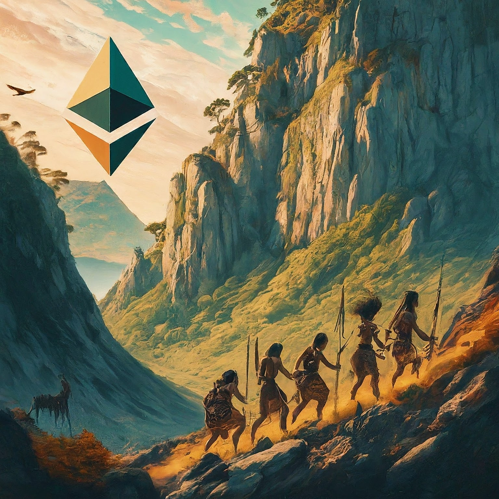

## Introduction ##

If Anima is the innately rational yet *connected* aspect of intelligence regardless of linguistic convention, i.e the anarchic intelligence    emanated in Creation (the ecology), then we approach the 'other' as uniquely embodied identity, in plain language, a person (not a role, responsibility or title). Previously we noted that Creation expresses masculine and feminine *aspects* distinct from notions of gender or sex in all life. As humans we, compete, explore, press into adventures. However we also nurture, hold, mentor, encourage, long to be at home. These are not mutually exclusive traits nor are they paradoxes. We hold these seemingly contradictory aspects just as we in turn exhale and inhale to seek balance. We each have bespoke ratios of these traits and we imagine that we may guide each other to express our two aspects in perfect balance as a species, as a whole.

This piece aims to reconcile notions of competition with anima that *exclude* animus - hostility and defensiveness (i.e. envy or vindictiveness). In our pastimes and games  we set forth rules and boundaries that define the parameters for legitimate behaviour (truth). Invariably it's when we emphasize the end result that beauty is removed from the spectacle.

Any exploration of prehistoric reality is conjecture but, remaining, unchanged in a foundational sense for 50,000 to 100,000 years we may postulate with common sense as a foundation. The close-knit communities of our distance past were naturally inclined to expressing anima both at home, by the hearth as well as away in the wilderness - collaborating to scale their tribe. 

Animus was the impulse of the *challenge* - a madness with method perhaps best exemplified by the Kiwi Haka wherein the 'All-Blacks' tell their opponents in no uncertain terms that they will not partner with them today - they have an obligation to those they represent and to Creation itself to decimate them in the ritual of *good* sport. Brazil's *Capoeira* reflects a similar idea - but very differently.

Pervasive through nature is the idea  that conservation of energy (capital) is tantamount especially in times of real *scarcity* It demands that peace and the search for equivalence be the *default* behaviour. 

In the 'real world' however when surviving at any cost became an imperative a tribe's introspection through internal dialogue concludes that its persistence requires the decimation of the others. In a sense a tribe's store of capital had been depleted;its balance (or equilibrium) hacked it now needs to be *restored* at the another's expense while preserving what remains of its own (at this point life and the bloodline).

This final segment of Sine Qua Non articulates a modern alternative for projecting apex authority: the power that comes from a self-sovereign narrative; an internal vision 'bored' into one's psyche so completely that one makes it real in the world. One takes maximal custody of the world and then through it husbands creation and the commons because the Sovereign, having lost legitimacy cannot maintain a persistent quorum among the people nor even decorum. Its behaviour is inchoate and incoherent so we are transitioning to *swaraj* or the self-sovereignty of practical and pragmatic life - anarchy.

## Chaos of Zero Trust ##

>Avarice and greed are gonna drive you over the endless sea
>They will leave you drifting in the shallows
>Drowning in the oceans of history
>Travellin' the world, you're in search of no good
>But I'm sure you'll build your Sodom like I knew you would
>Using all the good people for your galley slaves
>As your little boat struggles through the the warning waves
>
>But you don't pay, you will pay tomorrow
>You're gonna pay tomorrow, yeah
>You gonna pay tomorrow
>
>Save me, save me from tomorrow
>I don't want to sail with this ship of fools, no
>Oh, save me, save me from tomorrow
>I don't want to sail with this ship of fools, no, no, no
>
>~ World Party (Ship of Fools)

In 1896 Vilfredo Pareto heuristically observed that eighty percent of peas came from about twenty percent of his plants. However we don't just eat peas: a complex modern political-economy requires a profoundly diverse set of personalities to meet our equally complex set of needs and wants. In any case contentment doesn't just come down to abundance (which as choice proliferates with it can have the opposite impact).

Each of us has a unique set of attributes which lock or bind together to amount to something called an identity which expresses a personality.  The personality has a *telling* impact upon the collective meaning that it imparts an aura such that even an observant guest or visitor will discern the *nature* or quality of the nexus of ties that bind us in a group. For the canny reader of people we practically wear the sum of who we are on our person: our face, our gait, what we do with our hands, the way we wear our garments; whether we choose to speak or listen, and with whom. As well the words we use (if think it worthwhile to have a conversation). This nexus of ties amount to an augmented reality or meta narrative: something that *virtually* exists, is readily perceived by a keenly attentive interloper and can even be 'graphed' on another dimension or plane of perception. 

In civil society as it functions for most people, those ties are dictated by the power and influence an individual wields over others. This has until recently come down to how the much money they command personally or through their positions of authority. As well charisma; or the ability to appeal to emotion and established bonds of love is a factor.

In the last century technology enabled the sudden exponential spread of ideas, information and conversation. A quarter of the way through this century that conversation broke down. For me personally four events stand out:

- The wars in Iraq and Afghanistan beginning in 2001: Neither fundamentally solved problems but rather exacerbated them. The justification for the conflict in Iraq was a particularly galling fraud.  793 Canadian and British soldiers lost their lives.
- The 2008 Troubled Asset Relief Program (TARP) and their extraordinary bailout of incumbent financial institutions and other corporations that ultimately served no purpose in solving the underlying systemic inequity particularly in the wake of the expenditure of public funds on conflicts in Iraq and Afghanistan
- The 2013 persecution and exile of Ed Snowden who exercised his first amendment right to raise the United States' government's massive (illegal) surveillance of ordinary innocent Americans
- The 2020 acquisition of Corporate bonds by the Federal Reserve through 'Special Purpose Vehicles'. The justification, a flu virus, was deemed "unusual and exigent". In my view these went at least against the spirit if not the letter of the law dictating the regulation of these debt instruments. At any rate it revealed just how fragile this system is.

All of these attempts to perpetuate the power of incumbent institutions and their officers' privileges served only to discredit them in *absolute* terms. For me the loss of their legitimacy was complete and final - ending a journey that began shortly after I was born with what was then the 'temporary' suspension of the Gold Standard. I no longer recognize the authority of the United States government nor that of its agents (including corporations operating within the frameworks). In short they are aggressive expressions of panic and hysteria: ***animus*** directed by a leadership as much towards stakeholders as to outsiders. It is deeply offensive to a wide swarth of the engaged public and incurred deep hostility from both the left (Occupy) and the right (Tea Party).

As well I no longer assume that the guarantees and courtesies afforded me by my own 'countries' (Canada and the United Kingdom) are available, beholden as they are to their Hegemon. For the most part and as relates to our day to day lives, our laws are sensible and of course I obey them. But as for those statutes governing *economic* *contracts*? They are for me, including that foundational contract called the United States dollar, null and void. I limit my use of them to the degree possible. In a very real sense I operate as though I'm an independent country - running an austerity program for as long as it takes to enable total *swaraj* - self-determination and self-reliance. I am no longer just a philosophical anarchist but increasingly a practicing one.

This is a conversation about intelligence and as with the individual so with the sovereign: how you define (value) and use (price) money speaks volumes and, in the case of the United States Government, it is a tale told by an idiot full of sound and fury, signifying nothing. What I know today with certainty is that the country and the regime it governs is bankrupt and has been my *entire* life. 

From a systems perspective, the structure represents an unstable server; its equipment a loss leader for the poorly written code that runs it. It generates too much noise and heat at an exorbitant and increasingly untenable cost to those it was meant to serve. Many of us, realizing that the machine increasingly seems to serve its own interests rather than those it was installed for have decamped to set up a parallel Advanced RISC* Machine (ARM). To understand this new model 'ARMy' system design you have go back in time to understand how people conceived of, created and critically, *distributed* value when the sum of the parts were *designed* to fit together rather than cobbled together from a set of random surplus bits; and crucially before money (of *any* kind) existed. The maintenance of a level or equilibrium of welfare was of paramount important regardless of who generated the 'productivity'.

## The Virtual Machine ##

Since all contracts are compromised or at least sub-optimal let's take money out of the equation to imagine an alternative system: one without pyramid scheme hierarchies of practical strangers commanded by the self-styled giants among us. As well let's pivot from intelligence which we might agree is *equivalently*, if not equally endowed in that we *all* have a gift or Calling, to talk about leadership in an anarchist context. 

If we have gifts or a Calling then they are useful in so far as they make our living possible, interesting (in a good way) and fun in that order. You might not enjoy the prospect of changing a flat on a dark November morning in the middle of nowhere but doing it safely will allow you to persist. It will be interesting the first time and result in some growth - a new skill and a light dopamine hit from having solved a problem without help. Alternatively, you could take the path of least (POL) resistance and call a tow truck - spending money (after taxes), learning nothing and becoming boring, ordinary and unattractive. It's the slippery slope to becoming the inspiration for a new vision for mediocrity as a slow-cooked form of post-modern ambition. Something whose development may be savoured over the long span of a deteriorating circumstance you call quantity of life. There's a quiet epidemic wherein people put as little effort as possible to get as much out of the 'system'. It bleeds a system that doesn't itself actually create value anymore while removing from you the capacity to generate it for yourself. 

This is what life lived on devices is doing to us: It's giving us one easy fix after another, incrementally removing our capacity for thought and action and, incidentally, thinning both the ranks and the pipeline for leadership - people willing to make important but difficult decision to make investments that payoff over time (the only true form of passive capital there is): the path of most (POM) resistance - the one that yield long term benefits over an infinite time horizon.

So this then is how we take money out of the equation, or rather, reconstitute it as an opportunistic perspective that demands concrete real-world solutions to a current *dilemma* in small ways that builds attitudinally the momentum and platform for  continuous yield. This is an 'attitude' that seeks personal gain in real terms while reducing transactional 'noise' in the Commons. This is an attitude that frames wealth in terms of intelligence created through knowledge - in a term - intellectual (personal) property. As a starting point it says to the world, you've got enough to deal with let me see what I can do to solve my own problems. It builds self-esteem and rapidly develops into a capability for solving the other people's problems without costing them anything.

This is virtual money and it's what made prehistoric communities work or even the indigenous ones that came before us here in Ontario, where I live, such as the Wendat and Haudenosaunee. In a very real sense they made anarchy work for centuries by harnessing that feminine aspect of the masculine, anima, which seeks to nurture, build and create oneself and then project soft-power or capability rather than exploit or extract with fungible coercive force. The example above is a classic one - no guy would want to be caught 'up all ends' in the predicament above if he were out on a date. He'd sooner impress with a slick show of competence. It's an opportunity to impress and close the deal - not a problem. It's serendipity. Even if you don't know what you're doing - being able to take command of a situation like that calmly is a *cultivated* quality borne of repeated POM experience.

What made them different was the power of 'free stuff'. Our first nations were 'open source' in the real-world. They were Apache *before* it was software.

In Debt: The First 5,000 Years, David Graeber, the late anarchist anthropologist imagined our prehistoric ancestors wandering in small groups - well under the 150-odd with whom we can maintain a meaningful relationship. In these small, closely-knit communities we kept an approximate mental tally of who did what mostly to assure that nobody got left behind in terms of having what they needed to be a meaningful part of the community. What is intelligence? It surely does not manufacture a false sense of scarcity to maintain control. It starts of with an assumption that creation is abundance manifest which is infinitely divisible.

---

*RISC = Reduced Instruction Set Computer. Call this a rationalized operating system; a 'smart-contract enabled to pair-off or 'level' countervailing instructions to recover value lost as a negative externality (heat, particulate emission, noise) all of which serve to bring forward end-of-life and inflate costs.

